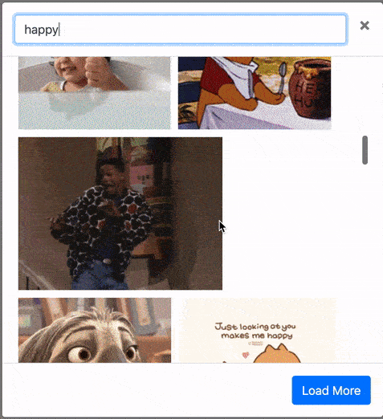

# GIFSearchInModal
Search for GIFs using the GIPHY API in a bootstrap modal

A tool that lets you search for GIFs using the GIPHY api. It then displays the retrieved results in a bootstrap modal. The user can also load content endlessly by clicking the "load more" button.

Demo
----

To improve:
- implement infinite scrolling
